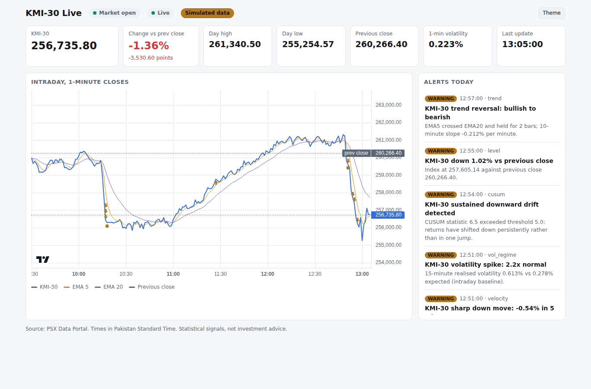

# KMI-30 Real-Time Monitor

An agent that polls the official PSX Data Portal (`dps.psx.com.pk`) for the **KMI-30** index, serves a live
web dashboard, and posts to **Slack** when the intraday trend deviates significantly.



## Quick start (Docker)

```bash
cp .env.example .env              # add SLACK_WEBHOOK_URL
docker compose up -d --build      # dashboard on http://localhost:8080
docker compose exec kmi30 kmi30 check        # verify PSX connectivity and response format
docker compose exec kmi30 kmi30 slack-test   # verify Slack delivery
```

Offline demo with synthetic data and no Slack (a full trading day plays in about 12 minutes):

```bash
docker compose --profile demo up --build kmi30-demo   # http://localhost:8081
```

### Slack setup

1. Create a Slack app at <https://api.slack.com/apps>, then enable **Incoming Webhooks**.
2. Choose **Add New Webhook to Workspace** and pick the channel.
3. Put the URL in `.env` as `SLACK_WEBHOOK_URL`. Treat it as a secret, because anyone holding it can post.

## How it works

```
PSX Data Portal ──poll 10s──▶ PSXClient ──ticks──▶ BarBuilder (1-min) ──▶ DetectionEngine ──▶ AlertGate ──▶ Slack
   /timeseries/int/KMI30        │ schema checks                               │                      │
   /timeseries/eod/KMI30        │ timestamp decoding                          ▼                      ▼
   /indices (fallback)          ▼                                     SQLite (ticks, bars,     FastAPI + WebSocket
                          MarketCalendar (PKT sessions, holidays)     EOD, alerts)             dashboard, /metrics
```

| Endpoint | Shape | Use |
|---|---|---|
| `/timeseries/int/KMI30` | `{"status":1,"data":[[epoch, value, volume], ...]}`, newest first, today only | Primary feed |
| `/timeseries/eod/KMI30` | `[[epoch, close, volume, open], ...]`, newest first | Previous close and daily volatility |
| `/indices` | HTML table: index, high, low, current, change, % change | Fallback when the JSON feed fails |

PSX does not publish a contract for these endpoints. The client validates every response and raises
`PSXSchemaError` on drift, which surfaces as feed alerts rather than silent bad data. PSX epochs are
Pakistan wall-clock seconds rather than true UTC. With `timestamp_mode: auto`, the client picks whichever
reading places the ticks inside trading sessions.

## Deviation detectors

All detectors run on event time, so a live run and a replay of the same data produce identical alerts.

| Detector | Signal | Default trigger | Catches |
|---|---|---|---|
| `level` | % change vs previous close | ±1% warning, ±2% critical, 0.25% hysteresis | Absolute moves |
| `velocity` | 5-min log return ÷ (EWMA 1-min σ × √5) | \|z\| ≥ 3 warning, ≥ 4.5 critical | Sudden shocks |
| `trend` | EMA5/EMA20 regime flip, held 2 bars, confirmed by 10-bar OLS slope | EMA gap ≥ 3σ | Trend reversals |
| `cusum` | Two-sided CUSUM on standardised 1-min returns, each clipped to ±4 | k = 0.5, h = 5 | Sustained drift that no single bar reveals |
| `vol_regime` | 15-min realised vol vs same-time-of-day history, or a slow intraday EWMA baseline | 2× warning, 3× critical | Volatility spikes |
| `feed` | Wall-clock staleness and poll failures | 3 min stale, 5 failed polls, no data 30 min after open | Data-quality problems |

Noise controls:

- **Warm-up.** Bar detectors are silent for 15 minutes after each session open, including the Friday afternoon re-open. `level` and `feed` stay live.
- **Cooldown.** Each alert key waits 15 minutes before firing again. A higher severity bypasses the cooldown.
- **Hysteresis.** A detector re-arms only after its signal falls back well inside the threshold.
- **Gap handling.** The return across a session break or feed gap is discarded rather than counted as a shock.
- **Restart safety.** On start-up the agent replays today's ticks silently and restores today's cooldowns from SQLite, so a restart does not re-send alerts.

Calibration: on a pure random walk at defaults, `trend` fires about 0.6 times per session and `cusum` less
than once per session. Tune on your own history before tightening thresholds:

```bash
kmi30 replay --date 2026-09-14          # replay a stored day through the detectors
kmi30 replay --ticks-file saved.json    # or a saved /timeseries/int response
```

The `vol_regime` detector switches from the intraday baseline to the same-time-of-day profile automatically.
That happens after 5 sessions of history have accumulated in the database.

## Configuration

`config.yaml` documents every setting with its default. Environment variables override the file:

| Variable | Purpose |
|---|---|
| `SLACK_WEBHOOK_URL` | Slack Incoming Webhook (secret) |
| `KMI30_DASHBOARD_URL` | URL for the "Open live view" button in Slack |
| `KMI30_SOURCE_MODE` | `live` or `simulated` |
| `KMI30_POLL_INTERVAL_S` | Poll interval in seconds, minimum 3 |
| `KMI30_DB_PATH` | SQLite path |
| `KMI30_CONFIG` | Config file path |

Keep `market.sessions` and `market.holidays` aligned with PSX notices. Ramadan timings differ from regular ones.

## Operations

| Endpoint | Meaning |
|---|---|
| `/healthz` | Liveness: the agent loop is cycling. A PSX outage does not fail it. |
| `/readyz` | Readiness: a poll has completed and data is under 10 min old during market hours. |
| `/metrics` | Prometheus: poll results and latency, index value, change %, tick age, σ, alerts, Slack deliveries |
| `/api/state` | Current dashboard snapshot as JSON |

Suggested Prometheus alerts are `kmi30_last_tick_age_seconds > 300 and kmi30_market_open == 1`
and a rising `rate(kmi30_slack_deliveries_total{result="failed"}[15m])`.

**Run a single replica.** Two replicas double the load on PSX and send every alert twice. On Kubernetes or
OpenShift, use a Deployment with `replicas: 1` and the `Recreate` strategy, a PVC for `/data`, and the
webhook in a Secret. Use `/healthz` for liveness and `/readyz` for readiness.

**Security.** The dashboard has no authentication and Compose binds it to loopback. To share it, put it behind
a reverse proxy with SSO, such as oauth2-proxy or an OpenShift Route with the OAuth proxy sidecar. The
container runs as a non-root user with a read-only root filesystem and all capabilities dropped.

## Limitations

- **Latency.** Polling is not a tick feed. Expect 10 to 20 seconds of lag on top of any delay in the portal itself. For trading-grade real-time data, use a licensed PSX market-data vendor.
- **Undocumented source.** PSX can change or rate-limit these endpoints at any time. The `check` command and the `feed` alerts are how you find out.
- **Terms of use.** This is built for personal monitoring. Review PSX's terms before redistributing the data.
- **Not investment advice.** Alerts are statistical signals.

## Development

```bash
python -m venv .venv && . .venv/bin/activate
pip install -e '.[dev]'
pytest                                       # unit, end-to-end (simulated portal) and web tests
KMI30_SOURCE_MODE=simulated kmi30 run        # local demo on :8080
```

Layout: `psx_client.py` (portal contract), `market_calendar.py`, `bars.py`, `detectors.py`, `engine.py`
(volatility model, warm-up, gating), `agent.py` (orchestration), `alerts.py` (Slack), `web.py` and
`static/index.html` (dashboard), `simulator.py` (synthetic portal for demos and tests).

The dashboard chart uses TradingView Lightweight Charts 4.2.3, vendored under the Apache-2.0 licence in
`src/kmi30/static/vendor/`.
